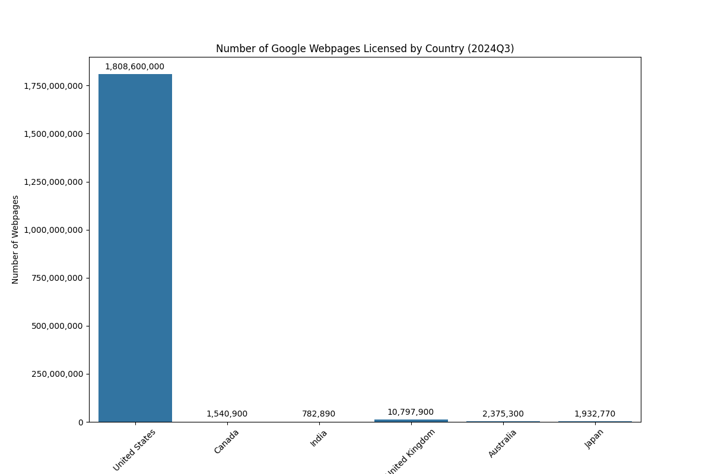

# 2024Q3 Quantifying the Commons
<!-- GCS Start -->
## Data Source: Google Custom Search

<!-- Country Report Start -->
### Country Report

Number of Google Webpages Licensed by Country
<!-- Country Report End -->
<!-- License Type Report Start -->
### License Type Report

Number of Webpages Licensed by License Type
<!-- License Type Report End -->
<!-- Language Report Start -->
### Language Report

Number of Google Webpages Licensed by Language
<!-- Language Report End -->
<!-- GitHub License Type Report Start -->
### GitHub License Type Report

Number of Repositories Licensed by License Type
<!-- GitHub License Type Report End -->
<!-- GCS End -->
