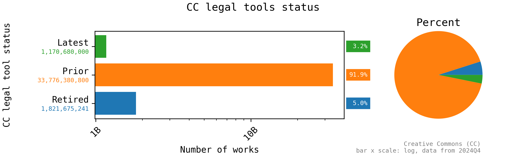
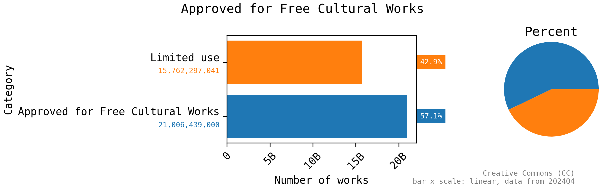

# Quantifying the Commons 2024Q4

<!-- Google Custom Search (GCS) Start -->

## Google Custom Search (GCS)

<!-- Overview Start -->

### Overview

Google Custom Search (GCS) data uses the `totalResults` returned by API for search queries of the legal tool URLs (quoted and using `linkSite` for accuracy), countries codes, and language codes.

**The results indicate there are a total of 36,768,736,041 online works in the commons--documents that are licensed or put in the public domain using a Creative Commons (CC) legal tool.**

Thank you Google for providing the Programable Search Engine: Custom Search JSON API!

<!-- Overview End -->

<!-- Products totals and percentages Start -->

### Products totals and percentages

Plots showing Creative Commons (CC) legal tool product totals and percentages.

<!-- Products totals and percentages End -->

<!-- CC legal tools status Start -->

### CC legal tools status

Plots showing Creative Commons (CC) legal tool status totals and percentages.

<!-- CC legal tools status End -->

<!-- Current CC legal tools Start -->

### Current CC legal tools

Plots showing current Creative Commons (CC) legal tool totals and percentages.

<!-- Current CC legal tools End -->

<!-- Old CC legal tools Start -->

### Old CC legal tools

Plots showing old Creative Commons (CC) legal tool totals and percentages.

The unit names have been normalized (~~`CC BY-ND-NC`~~ => `CC BY-NC-ND`).

<!-- Old CC legal tools End -->

<!-- Retired CC legal tools Start -->

### Retired CC legal tools

Plots showing retired Creative Commons (CC) legal tools total and percentages.

For more information on retired legal tools, see [Retired Legal Tools - Creative Commons](https://creativecommons.org/retiredlicenses/).

<!-- Retired CC legal tools End -->

<!-- Countries with highest usage of current tools Start -->

### Countries with highest usage of current tools

Plots showing countries with the highest useage of the current Creative Commons (CC) legal tools.

The current tools include Licenses version 4.0 (CC BY 4.0, CC BY-NC 4.0, CC BY-NC-ND 4.0, CC BY-NC-SA 4.0, CC-BY-ND 4.0, CC BY-SA 4.0), CC0 1.0, and the Public Domain Mark (PDM 1.0).

The complete data set indicates there are a total of 2,220,330,077 online works using a current CC legal tool.

<!-- Countries with highest usage of current tools End -->

<!-- Languages with highest usage of current tools Start -->

### Languages with highest usage of current tools

Plots showing languages with the highest useage of the current Creative Commons (CC) legal tools.

The current tools include Licenses version 4.0 (CC BY 4.0, CC BY-NC 4.0, CC BY-NC-ND 4.0, CC BY-NC-SA 4.0, CC-BY-ND 4.0, CC BY-SA 4.0), CC0 1.0, and the Public Domain Mark (PDM 1.0).

The complete data set indicates there are a total of 970,145,024 online works using a current CC legal tool.

<!-- Languages with highest usage of current tools End -->

<!-- Approved for Free Cultural Works Start -->

### Approved for Free Cultural Works

Plots showing Approved for Free Cultural Works legal tool usage.

For more information on retired legal tools, see [Understanding Free Cultural Works - Creative Commons](https://creativecommons.org/public-domain/freeworks/).

<!-- Approved for Free Cultural Works End -->

<!-- Google Custom Search (GCS) End -->

<!-- Notes Start -->

## Notes

<!-- Data locations Start -->

### Data locations

This report was generated as part of:

**[creativecommons/quantifying][repo]:** *quantify the size and diversity of the commons--the collection of works that are openly licensed or in the public domain*

The data used to generate this report is available in that repository at the following locations:

 | Resource        | Location |
 | --------------- | -------- |
 | Fetched data:   | [`../1-fetch/`](../1-fetch) |
 | Processed data: | [`../2-process/`](../2-process) |
 | Report data:    | [`../2-report/`](../2-report) |

[repo]: https://github.com/creativecommons/quantifying

<!-- Data locations End -->

<!-- Usage Start -->

### Usage

The Creative Commons (CC) icons, images, and logos are for use under the Creative Commons Trademark Policy (see [Policies - Creative Commons][ccpolicies]). **They *aren't* licensed under a Creative Commons license** (also see [Could I use a CC license to share my logo or trademark? - Frequently Asked Questions - Creative Commons][tmfaq]).

[![CC0 1.0 Universal (CC0 1.0) Public Domain Dedicationbutton][cc-zero-png]][cc-zero]
Otherwise, this report is dedicated to the public domain under the [CC0 1.0 Universal (CC0 1.0) Public Domain Dedication][cc-zero].

[ccpolicies]: https://creativecommons.org/policies
[tmfaq]: https://creativecommons.org/faq/#could-i-use-a-cc-license-to-share-my-logo-or-trademark
[cc-zero-png]: https://licensebuttons.net/l/zero/1.0/88x31.png "CC0 1.0 Universal (CC0 1.0) Public Domain Dedication button"
[cc-zero]: https://creativecommons.org/publicdomain/zero/1.0/ "Creative Commons — CC0 1.0 Universal"

<!-- Usage End -->

<!-- Notes End -->
