# Quantifying the Commons 2025Q4

<!-- SECTION start gcs_report.py -->

## Google Custom Search (GCS)

<!-- gcs_report.py entry start Overview -->

### Overview

Google Custom Search (GCS) data uses the `totalResults` returned by API for search queries of the legal tool URLs (quoted and using `linkSite` for accuracy), countries codes, and language codes.

**The results indicate there are approximately 29,878,784,642 online works in the commons--documents that are licensed or put in the public domain using a Creative Commons (CC) legal tool.**

Thank you Google for providing the Programable Search Engine: Custom Search JSON API!

<!-- gcs_report.py entry end Overview -->

<!-- gcs_report.py entry start Products totals and percentages -->

### Products totals and percentages

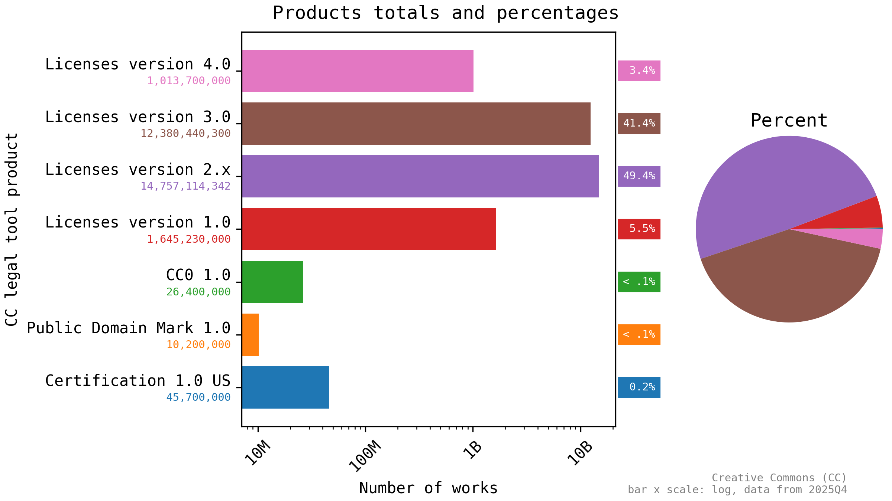

Plots showing Creative Commons (CC) legal tool product totals and percentages.

<!-- gcs_report.py entry end Products totals and percentages -->

<!-- gcs_report.py entry start CC legal tools status -->

### CC legal tools status

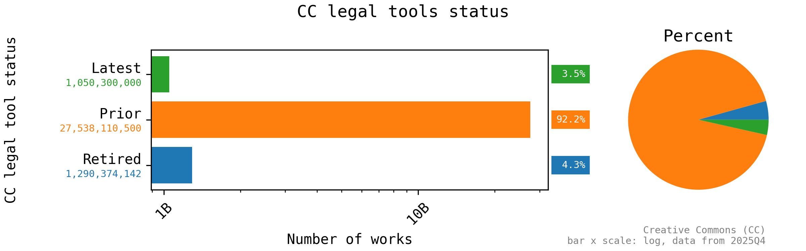

Plots showing Creative Commons (CC) legal tool status totals and percentages.

<!-- gcs_report.py entry end CC legal tools status -->

<!-- gcs_report.py entry start Latest CC legal tools -->

### Latest CC legal tools

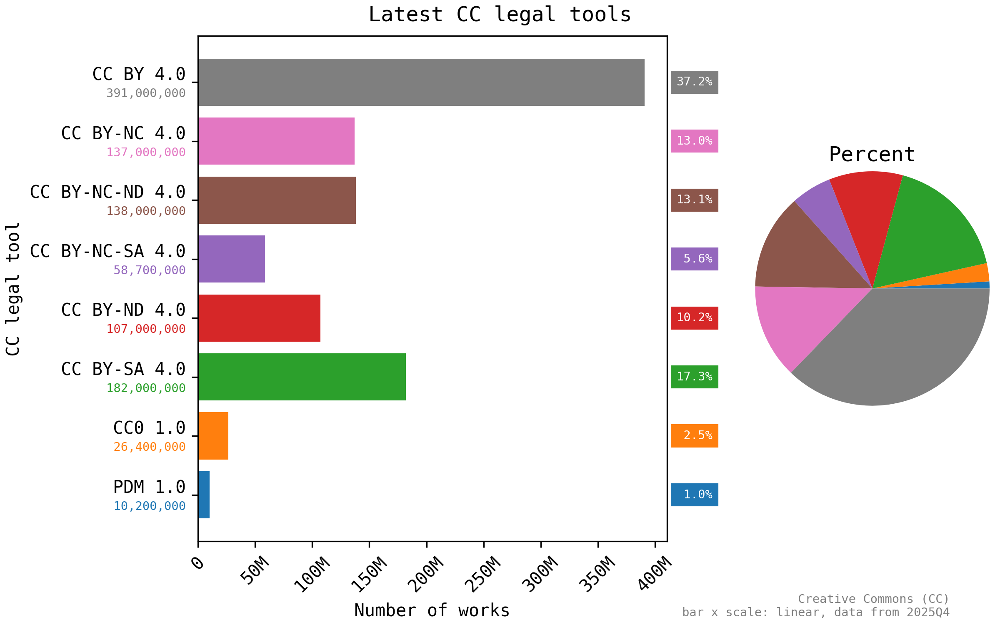

Plots showing latest Creative Commons (CC) legal tool totals and percentages.

<!-- gcs_report.py entry end Latest CC legal tools -->

<!-- gcs_report.py entry start Prior CC legal tools -->

### Prior CC legal tools

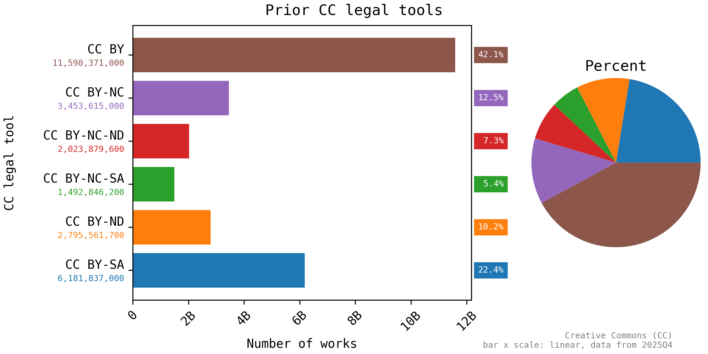

Plots showing prior Creative Commons (CC) legal tool totals and percentages.

The unit names have been normalized (~~`CC BY-ND-NC`~~ => `CC BY-NC-ND`).

<!-- gcs_report.py entry end Prior CC legal tools -->

<!-- gcs_report.py entry start Retired CC legal tools -->

### Retired CC legal tools

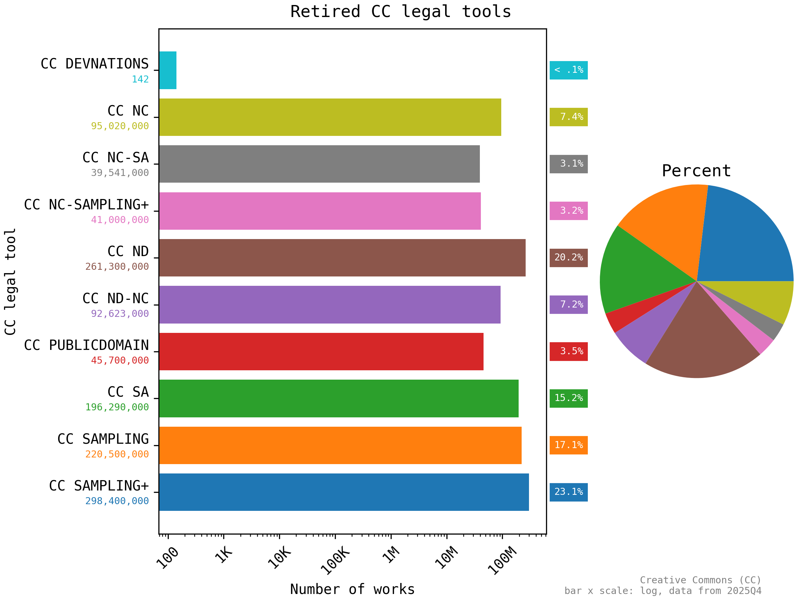

Plots showing retired Creative Commons (CC) legal tools total and percentages.

For more information on retired legal tools, see [Retired Legal Tools - Creative Commons](https://creativecommons.org/retiredlicenses/).

<!-- gcs_report.py entry end Retired CC legal tools -->

<!-- gcs_report.py entry start Countries with highest usage of latest tools -->

### Countries with highest usage of latest tools

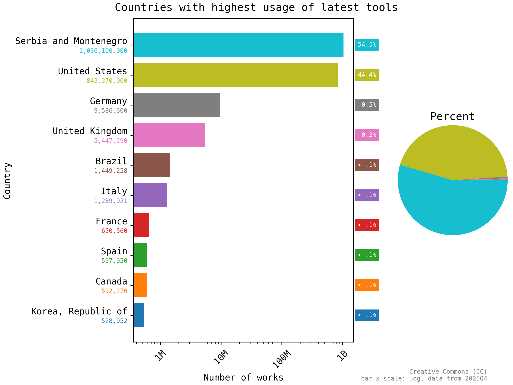

Plots showing countries with the highest useage of the latest Creative Commons (CC) legal tools.

The latest tools include Licenses version 4.0 (CC BY 4.0, CC BY-NC 4.0, CC BY-NC-ND 4.0, CC BY-NC-SA 4.0, CC-BY-ND 4.0, CC BY-SA 4.0), CC0 1.0, and the Public Domain Mark (PDM 1.0).

The complete data set indicates there are a total of 1,907,658,568 online works using a latest CC legal tool.

<!-- gcs_report.py entry end Countries with highest usage of latest tools -->

<!-- gcs_report.py entry start Languages with highest usage of latest tools -->

### Languages with highest usage of latest tools

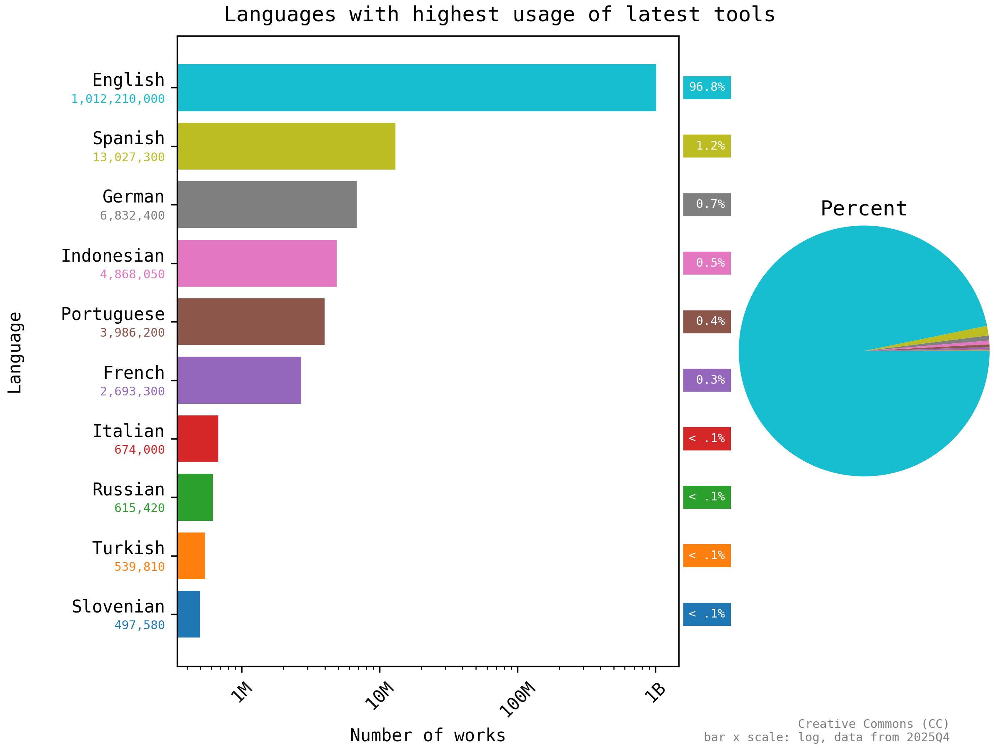

Plots showing languages with the highest useage of the latest Creative Commons (CC) legal tools.

The latest tools include Licenses version 4.0 (CC BY 4.0, CC BY-NC 4.0, CC BY-NC-ND 4.0, CC BY-NC-SA 4.0, CC-BY-ND 4.0, CC BY-SA 4.0), CC0 1.0, and the Public Domain Mark (PDM 1.0).

The complete data set indicates there are a total of 1,050,035,479 online works using a latest CC legal tool.

<!-- gcs_report.py entry end Languages with highest usage of latest tools -->

<!-- gcs_report.py entry start Approved for Free Cultural Works -->

### Approved for Free Cultural Works

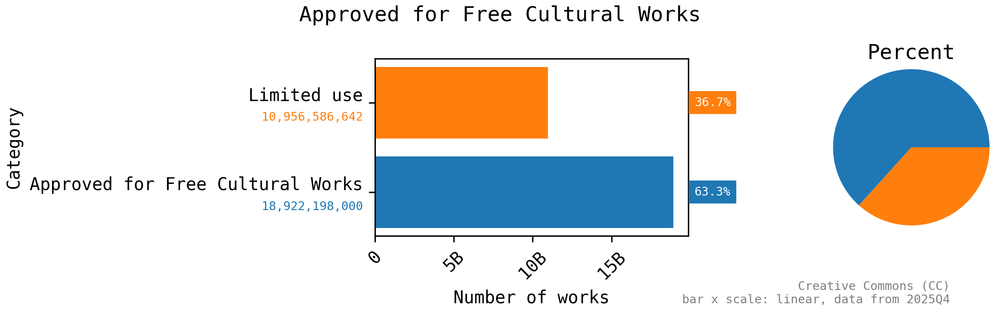

Plots showing Approved for Free Cultural Works legal tool usage.

[Understanding Free Cultural Works - Creative Commons](https://creativecommons.org/public-domain/freeworks/):

> Using [the Freedom Defined definition of a "Free Cultural Work"], material licensed under CC BY or BY-SA is a free cultural work. (So is anything in the worldwide public domain marked with CC0 or the Public Domain Mark.) CC’s other licenses– BY-NC, BY-ND, BY-NC-SA, and BY-NC-ND–only allow more limited uses, and material under these licenses is not considered a free cultural work.

<!-- gcs_report.py entry end Approved for Free Cultural Works -->

<!-- SECTION end gcs_report.py -->
<!-- SECTION start github_report.py -->

## GitHub

<!-- github_report.py entry start Overview -->

### Overview

The GitHub data, below, uses the `total_count` returned by API for search queries of the various legal tools.
**The results indicate that 465492 (0.17%)** of the 274465751 total public repositories on GitHub that use a CC legal tool. Additionally, many more use a non-CC use a Public domain equivalent legal tools.

 The GitHub data showcases the different level of rights reserved on repositories We have Public domain which includes works released under CC0, 0BSD and Unlicense meaning developers have waived all their rights to a software. Allowing anyone to freely use, modify, and distribute the code without restriction. See more at [Public-domain-equivalent license](https://en.wikipedia.org/wiki/Public-domain-equivalent_license).
 While a Permissive category of license contains works under MIT-0 and CC BY 4.0 allows users to reuse the code with some conditions and attribution [Permissive license](https://en.wikipedia.org/wiki/Permissive_software_license) and Copyleft contains works under CC BY-SA 4.0. which requires any derivative works to be licensed under the same terms. [Copyleft](https://en.wikipedia.org/wiki/Copyleft).

Thank you GitHub for providing public API access to repository metadata!

<!-- github_report.py entry end Overview -->

<!-- github_report.py entry start Totals by license type -->

### Totals by license type

](3-report/github_totals_by_license_type.png)

Plots showing totals by license type. This shows the distribution of different CC license and non CC license used in GitHub repositories. Allowing Commons to evaluate how freely softwares on GitHub are being used, modified, and shared and how developers choose to share their works. See more at [SPDX License List](https://spdx.org/licenses/)

<!-- github_report.py entry end Totals by license type -->

<!-- github_report.py entry start Totals by restriction -->

### Totals by restriction

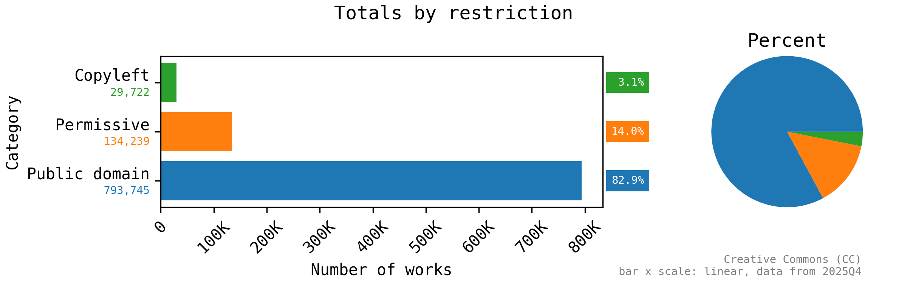

Plots showing totals by different levels of restrictions. This shows the distribution of Public domain, Permissive, and Copyleft licenses used in GitHub repositories.

<!-- github_report.py entry end Totals by restriction -->

<!-- SECTION end github_report.py -->
<!-- SECTION start wikipedia_report.py -->

## Wikipedia

<!-- wikipedia_report.py entry start Overview -->

### Overview

This report provides insights into the usage of the Creative Commons Attribution 4.0 International across the different language editions of Wikipedia. The Wikipedia data, below, uses the `Count` field from the Wikipedia API to quantify the number of articles in each language edition of Wikipedia.
**The total number of Wikipedia articles across 351 languages is 65,966,404. The top 10 languages account for 31,597,224 articles, which is 47.90% of the total articles. The average number of articles per language is 187,938.47.**
Thank you to the volunteers who curate this data and the Wikimedia Foundation for making it publicly available!

<!-- wikipedia_report.py entry end Overview -->

<!-- wikipedia_report.py entry start Language Representation -->

### Language Representation

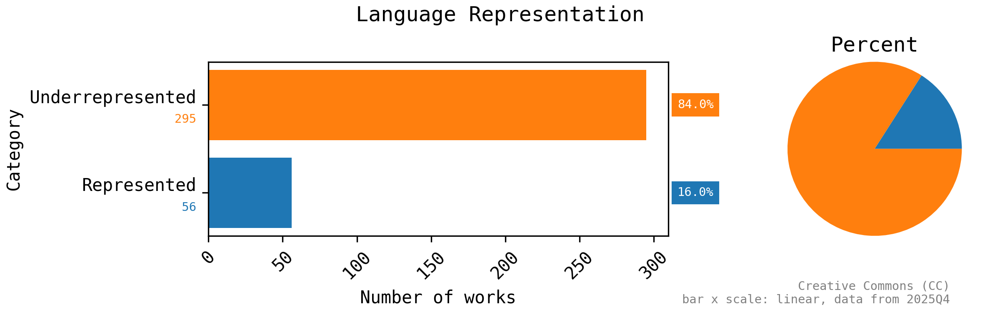

Plots showing the language representation across different language editions of Wikipedia. This shows how many languages are underrepresented (below average number of articles) versus represented (above average number of articles).

<!-- wikipedia_report.py entry end Language Representation -->

<!-- wikipedia_report.py entry start Most represented languages -->

### Most represented languages

Plots showing the most represented languages across the differentlanguage editions of Wikipedia.

<!-- wikipedia_report.py entry end Most represented languages -->

<!-- wikipedia_report.py entry start Least represented languages -->

### Least represented languages

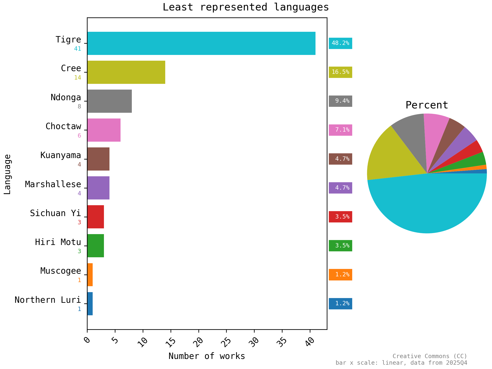

Plots showing the least represented languages across the different language editions of Wikipedia.

<!-- wikipedia_report.py entry end Least represented languages -->

<!-- SECTION end wikipedia_report.py -->
<!-- SECTION start zzz-notes.py -->

## Notes

<!-- zzz-notes.py entry start Data locations -->

### Data locations

This report was generated as part of:

**[creativecommons/quantifying][repo]:** *quantify the size and diversity of the commons--the collection of works that are openly licensed or in the public domain*

The data used to generate this report is available in that repository at the following locations:

 | Resource        | Location |
 | --------------- | -------- |
 | Fetched data:   | [`1-fetch/`](1-fetch) |
 | Processed data: | [`2-process/`](2-process) |
 | Report data:    | [`3-report/`](3-report) |

[repo]: https://github.com/creativecommons/quantifying

<!-- zzz-notes.py entry end Data locations -->

<!-- zzz-notes.py entry start Usage -->

### Usage

The Creative Commons (CC) icons and logos are for use under the Creative Commons Trademark Policy (see [Policies - Creative Commons][ccpolicies]). **They *aren't* licensed under a Creative Commons license** (also see [Could I use a CC license to share my logo or trademark? - Frequently Asked Questions - Creative Commons][tmfaq]).

[![CC0 1.0 Universal (CC0 1.0) Public Domain Dedicationbutton][cc-zero-png]][cc-zero]
Otherwise, this report (including the plot images) is dedicated to the public domain under the [CC0 1.0 Universal (CC0 1.0) Public Domain Dedication][cc-zero].

[ccpolicies]: https://creativecommons.org/policies
[tmfaq]: https://creativecommons.org/faq/#could-i-use-a-cc-license-to-share-my-logo-or-trademark
[cc-zero-png]: https://licensebuttons.net/l/zero/1.0/88x31.png "CC0 1.0 Universal (CC0 1.0) Public Domain Dedication button"
[cc-zero]: https://creativecommons.org/publicdomain/zero/1.0/ "Creative Commons — CC0 1.0 Universal"

<!-- zzz-notes.py entry end Usage -->

<!-- SECTION end zzz-notes.py -->
